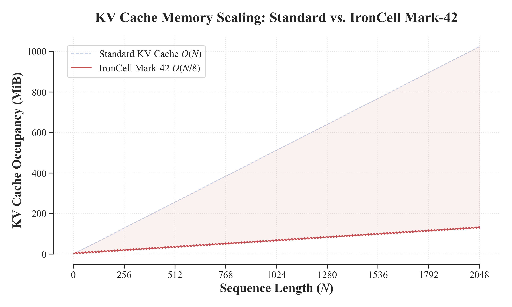
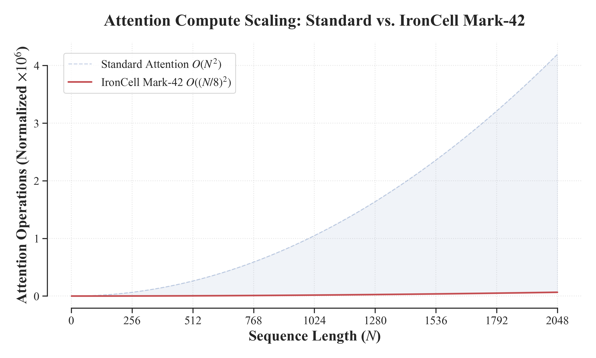
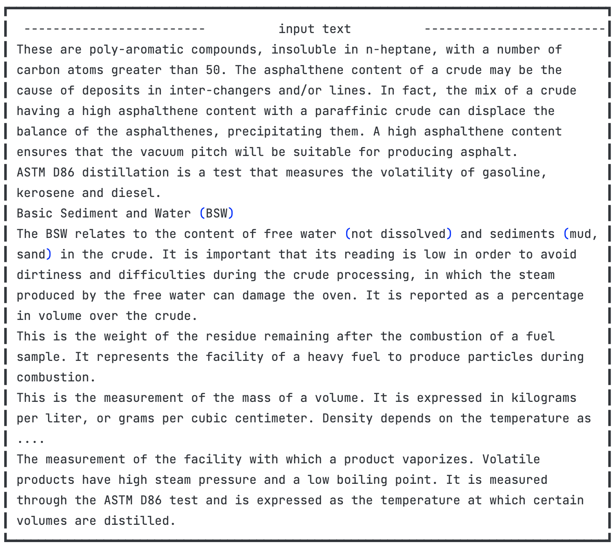
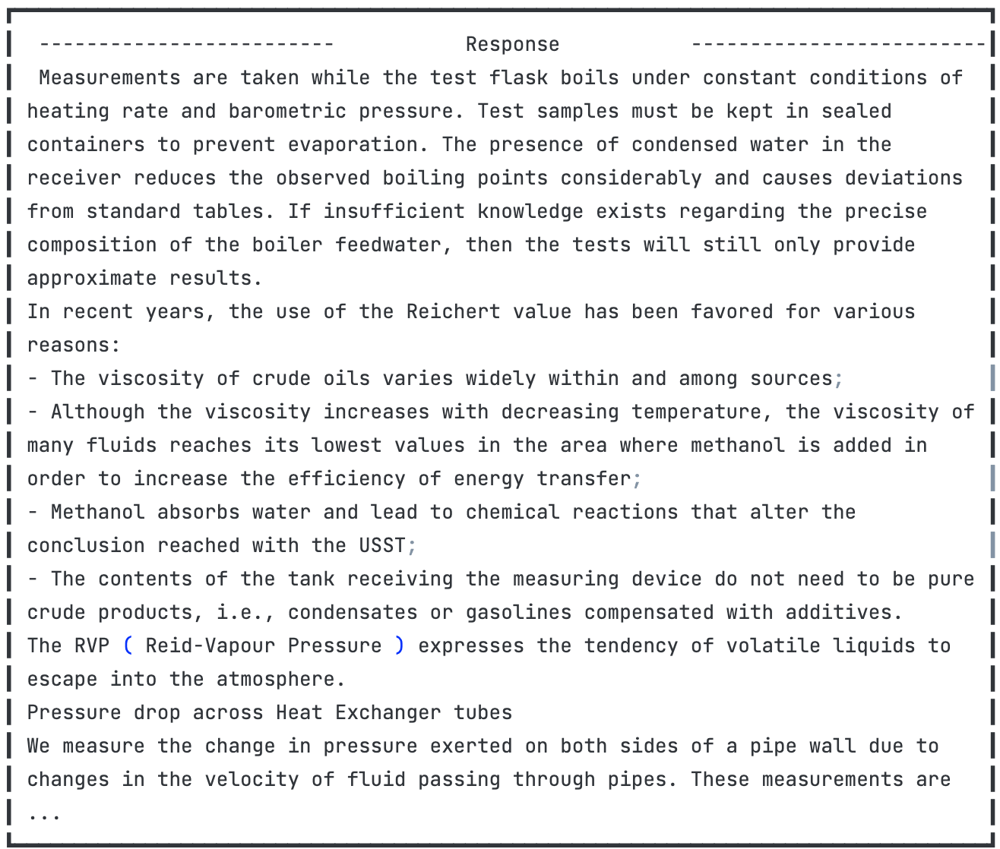
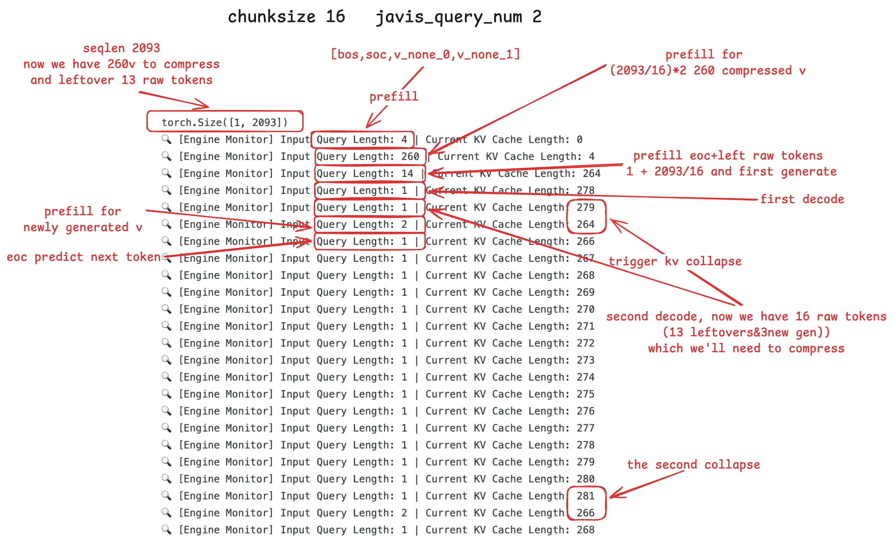

# IronCell — Mark 42


## The Breakthroughs of Mark-42
### The 16:2 Compress&Accelerate (TL;DR)

| Metric | Baseline (100%) | Mark-42  | Reduction |
| :--- | :--- | :--- | :--- |
| **VRAM Usage** | $100\%$ | **$6.25\%$** | **↓ 87.5%** |
| **Attn Compute FLOPs** | $O(N^2)$ | **$O((N/8)^2)$** | **↓ 98.4%** |


* **Logic Integrity**: Successfully maintained full generation capabilities.
* **Stability**: Verified via rigorous **Streaming Generation** stress tests.
### 1. VRAM Reduction: $O(N) \rightarrow O(N/8)$ Constant Sawtooth


Native LLMs suffer from a linear explosion of KV Cache memory. Mark-42 locks the memory into an $O(N/8)$ state machine. The "Sawtooth Drop" demonstrates the engine actively discarding raw local tokens and replacing them with high-density Javis states.  VRAM usage drops by **87.5%**.

### 2. Compute FLOPs Reduction: $O(N^2) \rightarrow O((N/8)^2)$ 

As sequence length ($N$) scales, the quadratic complexity ($O(N^2)$) of the self-attention mechanism quickly overtakes the linear feed-forward layers, becoming the absolute dominant bottleneck in compute FLOPs and latency. By physically annihilating the sequence dimension by a constant ratio of 8:1, IronCell Mark-42 cuts the attention matrix multiplication overhead by $8^2 = 64$ times. As the standard model's compute cost skyrockets exponentially, Mark-42's compute curve remains essentially flat, neutralizing 98.4% of the attention computational burden.

## 📊 Verification

IronCell Mark-42 fundamentally alters the scaling laws of long-context generation by executing an asymmetric manifold collapse. This is not weight quantization; this is sequence-dimension physical annihilation.

### 1. Proof of Capability: The Inference Demo
To prove that the deep $v$ vectors retain high-fidelity global semantics without polluting local syntax, I fed the Mark-42 engine a 2,000+ token dense academic text on petrochemical distillation.
**Input Prompt (2093 Tokens):**

> **Behind the scenes:** The engine silently rolled its $O(1)$ window, physically destroying and collapsing these 2000+ words into exactly 260 high-dimensional $V$ vectors. The original words were completely flushed from VRAM.

**Output Generation (Temperature=0.7, Repetition Penalty=1.15):**

> **The Result:** Even though the model was essentially "blind" to the exact physical tokens of the prompt, the deep residual gates successfully recalled core domain concepts (e.g., "viscosity", "Reid-Vapour Pressure / RVP", "Heat Exchanger"). The text flows with perfect syntactic coherence, proving that **semantic memory survived the manifold collapse.**

### 2. Proof of Concept: The Mathematical Log Analysis


As shown in the exact `infra.py` engine monitor logs, a 2093-token raw prompt is instantly crushed into 260 deep $V$ vectors. During generation, whenever the local sliding window hits the threshold, the engine triggers a physical cut-off, collapsing the oldest tokens and violently flushing the working memory back to the baseline.


## 🧬 Cellular Differentiation Theory (The Stem Cell Metaphor)

Current pre-trained LLMs are largely treated as rigid state machines—once trained, their internal topology is locked, and they can only be superficially fine-tuned. 

IronCell Mark-42 explores **Homologous Model Differentiation**. I treat a single, frozen pre-trained checkpoint (here: **Llama 3.1 8B**) as a pluripotent "stem cell." Just as biological stem cells differentiate into muscle cells for movement or neurons for thought, I induce functional differentiation into two identical homologous clones:
1. **The Compressor (cmp)**: Differentiated to specialize in dense memory encoding and reading raw context.
2. **The Generator (gen)**: Differentiated to specialize in syntax preservation and logical decoding.

**The Synapse (Javis)**: To bridge these two differentiated cells, I introduce **Javis**—a trainable connective module acting as the neural pathway. Javis does not merely route data; it utilizes trainable queries ($q$) to actively extract dense semantic information from the Compressor's hidden states via Cross-Attention. This highly concentrated information is then injected into the Generator at two critical levels: first into the base input embeddings, and subsequently into the KV caches of explicitly chosen deep target layers (e.g., layers 15, 23, 31). This deep dual-injection mechanism physically counteracts the severe degradation and loss of original global semantics as information propagates through the rigid, layer-by-layer forward pass of the Generator.

This architecture proves that clones of the exact same homologous pre-trained model can achieve post-training symbiosis and functional expansion. Instead of communicating through discrete, lossy text tokens, they collaborate natively via continuous latent spaces, keeping generation stable and controllable.


## Data, Results, Repro
### ENV
- **Data**: FineWeb-Edu (HF). Phase-full uses **50,000** samples (each ~10k–30k chars)
- **Phase-warmup**: train only **Javis + new special tokens**
- **Phase-cmp**: unfreeze **cmp + Javis** 
- **Phase-full**: unfreeze **cmp + gen + Javis** 
- **Repro**: **8×A800**, reproducible in one day.
- **Checkpoints**: Available on [HuggingFace](https://huggingface.co/ddddamn/IronCell-Mark-42/tree/main)
- **Loss curve**: [WandB](https://wandb.ai/gaoang001111-none/IronMan/overview)

### How to Reproduce
1. Clone the repository: 
```bash
git clone https://github.com/gaoang1111/IronMan.git
```
2. Download the Mark-42 model checkpoint: 
```bash
pip install -U "huggingface_hub[cli]"
huggingface-cli download ddddamn/IronCell-Mark-42 --include "phase-full/*" --local-dir ./checkpoints/Mark-42
```
3. Install dependencies: `pip install -r requirements.txt`

#### Inference
-  Run the inference demo under src.infra.infra.ipynb
#### Train
-  Run the train script under scripts/run_phase_(warmup|cmp|full).sh


Citation
If you find IronCell Mark 1 helpful in your research or applications, please cite it using the following format:

@misc{ironcell2026,
  title={IronCell Mark 1: 16:1 Full Sequence Compression via Homologous Model Differentiation},
  author={gaoang1111},
  year={2026},
  publisher={GitHub},
  journal={GitHub Repository},
  howpublished={\url{https://github.com/gaoang1111/IronMan}}
}

