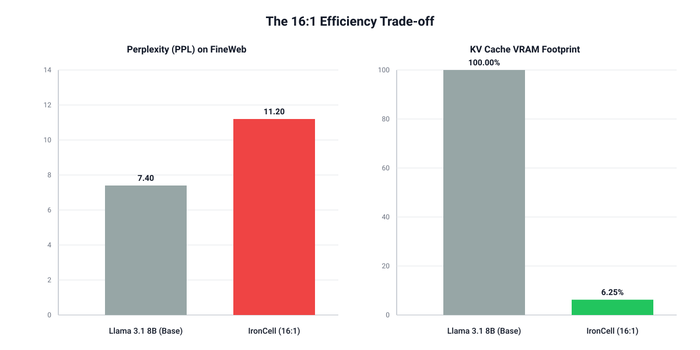

# IronCell — Mark 1



## The 16:1 Efficiency Trade-off

- **VRAM Footprint**: reduced by **93.75%** (from 100% down to **6.25%**).
- **Logic Integrity**: maintained **11.20 PPL** on FineWeb (**zero-overlap**), compared to Llama 3.1 8B’s baseline of **7.40**.
- **Verdict**: a marginal perplexity increase for an *impossible* context capacity on consumer GPUs.

## Data, Results, Repro (TL;DR)

- **Data**: FineWeb-Edu (HF). Phase2 uses **10,000** samples (each ~10k–30k chars), **zero-overlap** within the first 150 steps.
- **Phase1 (alignment)**: train only **proj + new special tokens**, loss **12.8 → 4.12** in ~20 steps (healthy grad norm).
- **Phase2 (differentiation)**: unfreeze **cmp + gen + proj** with L2 regularization; eval loss every 30 steps: **2.72 → 2.49 → 2.44 → 2.43 → 2.41** (to 150 steps).
- **Repro**: **8×A800**, reproducible in an afternoon.
- **Checkpoints**: uploaded to HuggingFace (https://huggingface.co/ddddamn/IronCell-Mark-1/tree/main).
- **Loss curve**: WandB (https://wandb.ai/gaoang001111-none/IronMan/overview).

IronCell is a 16:1 long-context compression prototype that explores:

- **Inter-model collaboration** via high-dimensional hidden states / compressed vectors **V** injected into the generator.
- **Capability differentiation and expansion** on top of already-trained models, while keeping loss stable and controllable.

Mark 1 is the feasibility prototype. The open-source community is invited to build a more modular, more autonomous Mark 42.

## Cellular Differentiation Theory (Motivation)

I view a pretrained LLM as a powerful but rigid “state machine” with poor extensibility.

- Humans expand capability by differentiating specialized cells (muscle, neurons, etc.) and composing them into a coherent whole.
- A monolithic, non-extensible model is unlikely to scale into the AGI era.

IronCell Mark 1 treats a homologous base as a “stem cell” (here: **Llama 3.1 8B**) and induces functional differentiation into:

- **Compressor (cmp)**: compresses raw chunks into semantic vectors.
- **Generator (gen)**: reconstructs/generates conditioned on those compressed vectors.

## Components

- **Compressor (cmp)**: encodes raw text chunks (frozen in Phase1; trainable in Phase2).
- **Projector (proj)**: a linear mapping from compressor hidden space to generator hidden space, producing compressed vectors **V**.
- **Generator (gen)**: a causal LM trained with custom `inputs_embeds` + custom `attention_mask`.

## Zipper Layout (Training vs Inference)

### Training Layout (Masked Parallel Training)

Training uses a “control chain + raw chunks” layout, e.g.:

```
[<bos>][<soc>]  V-1  [<eoc>]  V0  [<eoc>]  V1  [<eoc>] ... Raw_Token chunks
```

- The subscript `k` in `V_k` means “the compressed result of the k-th raw chunk”.
- `V-1` is an initial placeholder slot to keep the geometry consistent across samples.
- This layout is designed for **masked parallel training** with the Staircase(Zipper) mask, so each raw segment can only attend to the permitted range of control tokens (no leakage).

Implementation references:

- `build_zipper_mask_posid` in [src/data_processor.py](src/data_processor.py#L41-L151)
- `build_zipper_labels` in [src/data_processor.py](src/data_processor.py#L177-L242)
- `IronCellCollator` in [src/data_processor.py](src/data_processor.py#L304-L419)

### Inference Layout (TODO)

Inference is expected to look closer to:

```
[<bos>][<soc>]  V-1  V0  V1 ... [<eoc>] Raw_Token chunk
```

Notes:

- Inference needs a dedicated forward path for generating/rolling `V`, placing `[<eoc>]`, and constructing an inference-time attention mask.
- The current repo focuses on training (collator + mask + training loop); inference-time forward is not implemented yet (TODO).

## Special Tokens

IronCell uses 3 special tokens: `<soc>`, `<eoc>`, `<v_none>`.

- You can enable “train only special-token embedding table”: freeze the base embedding table and only update the special-token sub-embedding (see `TRAIN_ONLY_SPECIAL=true` in scripts).

## Data

Training/eval data is JSONL. Each line must include:

```json
{"text": "..."}
```

Data notes:

- Downloaded from HuggingFace FineWeb-Edu.
- Phase2 uses 10,000 samples with ~10k–30k characters per sample.
- No repeated samples within the first 150 steps (single pass, zero-overlap).

### Data Preparation

Notebook:

- `scripts/data_prepare.ipynb`

Example:

```bash
jupyter lab scripts/data_prepare.ipynb
```

The notebook typically writes JSONL outputs to `../data/`, e.g.:

- `../data/phase1_train.jsonl`
- `../data/phase1_eval.jsonl`
- `../data/phase2_train.jsonl`

## Training

### Phase1 (Alignment: proj + special)

Goal: train only projector + new special tokens to align the compressed signal quickly.

- ~20 steps: loss **12.8 → 4.12**
- Grad norm stays healthy

Example (8 GPUs, DDP):

```bash
MODEL_NAME=<HF_MODEL_ID_OR_LOCAL_PATH> \
DATA_PATH=../data/phase1_train.jsonl \
OUTPUT_DIR=checkpoints/phase1 \
TRAIN_ONLY_SPECIAL=true \
PARALLEL=ddp \
bash scripts/run_phase1.sh
```

### Phase2 (Differentiation: unfreeze cmp + gen)

Goal: unfreeze model weights and let cmp/gen differentiate into a stable decoder of compressed memory.

- Uses **L2 regularization** to constrain the magnitude of `V` (see `TrainStepModule` in [src/train.py](src/train.py#L97-L139)).
- Eval loss (every 30 steps): **2.72 → 2.49 → 2.44 → 2.43 → 2.41** (to 150 steps).

Example:

```bash
bash scripts/run_phase2.sh
```

## Evaluation (PPL)

Script: `scripts/eval_ppl.py`

```bash
python scripts/eval_ppl.py \
  --ckpt_dir <PATH_TO_CHECKPOINT_DIR> \
  --data_path ../data/phase1_eval.jsonl \
  --phase phase2 \
  --max_batches 50
```

Outputs: `eval_loss` and `ppl=exp(loss)`.

## Checkpoints

- Checkpoints are uploaded to HuggingFace (https://huggingface.co/ddddamn/IronCell-Mark-1/tree/main).
- After downloading, point `--ckpt_dir` to the local checkpoint directory and run `scripts/eval_ppl.py`.

## Engineering Notes

- **Weight decay grouping**: any parameter name containing `bias/layer_norm/layernorm/ln_` uses `weight_decay=0`; other trainable params use the provided `weight_decay`.
- **FSDP dtype**: FSDP flattening requires uniform dtype within a flatten unit; this repo aligns projector/special embeddings dtype to generator dtype (bf16).

## Mark 42 (Invitation)

Mark 1 is a prototype. Mark 42 is the invitation:

- Inference-time forward (rolling `V` + inference mask)
- A stronger collaboration protocol (multi-model routing, redundancy, fault tolerance)
- More standardized reproducibility and benchmarks

And there will be more...

Citation
If you find IronCell Mark 1 helpful in your research or applications, please cite it using the following format:

@misc{ironcell2026,
  title={IronCell Mark 1: 16:1 Full Sequence Compression via Homologous Model Differentiation},
  author={gaoang1111},
  year={2026},
  publisher={GitHub},
  journal={GitHub Repository},
  howpublished={\url{https://github.com/gaoang1111/IronMan}}
}

